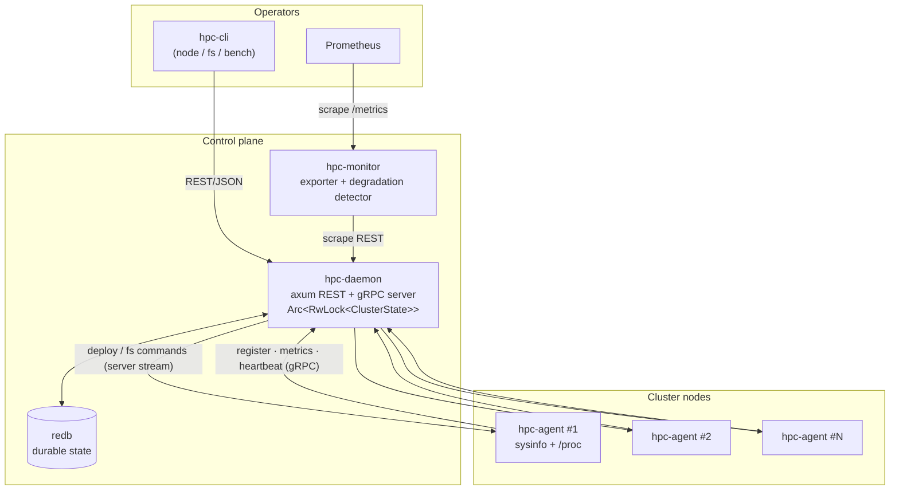

# hpc — HPC Filesystem Management Framework

A production-shaped control plane for managing parallel/distributed filesystems
across an HPC cluster: a central **daemon** tracks cluster state and issues
work, lightweight **agents** run on every node to report metrics and execute
filesystem/deploy commands, a **CLI** drives it all, a **monitor** exposes
Prometheus metrics with degradation detection, and a **benchmark** suite
measures I/O with real latency histograms.

Written in async Rust. Every crate propagates errors properly (no `unwrap()` in
library code), traces with `tracing`, and is configured with `serde` + TOML.
Daemon ⇄ agent communication is gRPC over `tonic`.

```
                            ┌──────────────────────────────────────────────┐
                            │                 hpc-daemon                   │
   hpc (CLI) ───REST/JSON──▶│  axum REST API   +   Arc<RwLock<ClusterState>>│
                            │  gRPC ClusterService     │        │           │
 hpc-monitor ──scrape REST─▶│  redb (durable state) ◀──┘        │           │
   │  /metrics              └───────────▲───────────────────────┼───────────┘
   ▼                          gRPC      │                       │ push commands
 Prometheus              register/metrics│                      │ (server stream)
                          heartbeat      │                      ▼
                            ┌────────────┴───────────────────────────────────┐
                            │  hpc-agent (one per node)                       │
                            │  sysinfo + /proc metrics · executes fs/deploy   │
                            └─────────────────────────────────────────────────┘

 hpc-bench ── async I/O benchmark suite (seq/rand read/write, HdrHistogram) ──▶ used by `hpc bench`
 hpc-core ── shared types · config · error · tracing (every crate depends on it)
```

## Architecture



### Why agents dial *out*

Node agents are gRPC **clients**; the daemon hosts the server. Storage/compute
nodes commonly sit behind restrictive firewalls, so having agents dial out
removes any inbound-connectivity requirement. The daemon still needs to *push*
work, so on registration each agent opens a long-lived **server-streaming** RPC
(`StreamCommands`) down which the daemon writes deploy and filesystem commands.
Agents report each command's outcome back with a unary RPC. See
[`proto/hpc.proto`](proto/hpc.proto).

## Crates

| Crate | Kind | Responsibility |
|-------|------|----------------|
| [`hpc-core`](hpc-core/) | lib | Shared domain types, TOML config, `thiserror` error type, `tracing` setup. Every crate depends on it. |
| [`hpc-daemon`](hpc-daemon/) | bin | Management server: gRPC `ClusterService`, `Arc<RwLock<…>>` cluster state, redb persistence, axum REST API. |
| [`hpc-agent`](hpc-agent/) | bin | Per-node agent: `sysinfo` + `/proc` metrics collection, gRPC client, command executor. |
| [`hpc-cli`](hpc-cli/) | bin (`hpc`) | Operator CLI: `node` (list/deploy/status), `fs` (mount/unmount/status), `bench` (run/report). |
| [`hpc-monitor`](hpc-monitor/) | bin | Prometheus `/metrics` endpoint, scrape loop, threshold-based degradation detection. |
| [`hpc-bench`](hpc-bench/) | lib + bench | Async I/O benchmark suite: sequential + random read/write, latency histograms, Criterion benches. |

## The control-plane protocol

`ClusterService` (defined in [`proto/hpc.proto`](proto/hpc.proto)):

| RPC | Direction | Purpose |
|-----|-----------|---------|
| `RegisterNode(NodeInfo) → RegisterAck` | agent → daemon | Announce a node (idempotent). |
| `Heartbeat(NodeRef) → HeartbeatAck` | agent → daemon | Cheap liveness; carries directives (e.g. `reregister`). |
| `ReportMetrics(stream MetricsReport) → MetricsAck` | agent → daemon | Client-streamed resource samples. |
| `StreamCommands(NodeRef) → stream Command` | daemon → agent | Server-streamed deploy/fs commands. |
| `ReportCommandResult(CommandResult) → Ack` | agent → daemon | Terminal command outcome. |

The four message types the framework centres on — `NodeInfo`, `MetricsReport`,
`DeployCommand`, `FsCommand` — plus their acks and a `Command` envelope
(`oneof { DeployCommand, FsCommand }`) are all defined there.

## Quick start

```bash
# 1. Build everything
cargo build --release

# 2. Run the daemon (defaults: gRPC :7443, REST :8080, state in /var/lib/hpc)
./target/release/hpc-daemon --config configs/daemon.toml

# 3. Run an agent on each node (dials the daemon)
./target/release/hpc-agent --config configs/agent.toml
#    …or override the endpoint inline:
./target/release/hpc-agent --endpoint http://daemon-host:7443

# 4. Drive it with the CLI
export HPC_API=http://127.0.0.1:8080
./target/release/hpc node list
./target/release/hpc node status my-node
./target/release/hpc fs mount my-node --device /dev/sdb1 --mount-point /mnt/scratch --fs-type xfs --opt noatime
./target/release/hpc fs status my-node

# 5. Expose metrics for Prometheus
./target/release/hpc-monitor --config configs/monitor.toml   # serves :9090/metrics

# 6. Benchmark a filesystem
./target/release/hpc bench run --path /mnt/scratch --file-size 268435456 --json report.json
./target/release/hpc bench report report.json
```

Example configuration files live in [`configs/`](configs/). Every field has a
built-in default, so a missing config file still yields a working process.

### What a live session looks like

```
$ hpc node list
┌─────────────┬─────────┬──────────┬─────┬─────┬──────┬───────────┐
│ NODE        ┆ ROLE    ┆ STATUS   ┆ CPU ┆ MEM ┆ DISK ┆ LAST SEEN │
╞═════════════╪═════════╪══════════╪═════╪═════╪══════╪═══════════╡
│ storage-01  ┆ storage ┆ healthy  ┆ 12% ┆ 41% ┆ 63%  ┆ 1s ago    │
│ storage-02  ┆ storage ┆ degraded ┆ 48% ┆ 86% ┆ 99%  ┆ 1s ago    │
└─────────────┴─────────┴──────────┴─────┴─────┴──────┴───────────┘

$ hpc fs mount storage-01 --device /dev/sdb1 --mount-point /mnt/scratch --fs-type xfs --opt noatime
mount accepted: command=fs-… node=storage-01 (/dev/sdb1 -> /mnt/scratch)
```

## Safety model

Filesystem operations are destructive and need root. The agent defaults to
`allow_exec = false`: commands are validated and the exact argv is logged and
returned as a **dry-run**, so the whole system is safe to run on a laptop or in
CI. Set `allow_exec = true` to actually spawn `mount`/`umount`/`fsck`. The
destructive `format` action additionally requires `force = true`, enforced both
at the REST boundary and in the executor.

## Engineering conventions

- **No `unwrap()` in library code.** Everything returns
  `hpc_core::Result<T>` (a `thiserror` enum) and propagates with `?`. Binaries
  use `anyhow` for top-level context; `unwrap`/`expect` appear only in tests and
  the Criterion harness.
- **Async-safe shared state.** The daemon's cluster state is
  `Arc<RwLock<ClusterState>>`, written through to redb on every mutation and
  rehydrated on restart.
- **Tracing everywhere**, configurable via TOML or `RUST_LOG`, human or JSON.
- **One source of truth for types.** `hpc-core` owns the domain model; the
  daemon/agent convert to/from protobuf only at the gRPC boundary.

## Development

```bash
cargo test --workspace          # unit + integration tests
cargo clippy --workspace --all-targets -- -D warnings
cargo fmt --all --check
cargo bench -p hpc-bench        # Criterion I/O micro-benchmarks
```

Requires a recent stable Rust (1.82+) and `protoc` (the Protocol Buffers
compiler) on `PATH` for the daemon/agent build scripts.

## License

Dual-licensed under either of Apache-2.0 or MIT at your option.
